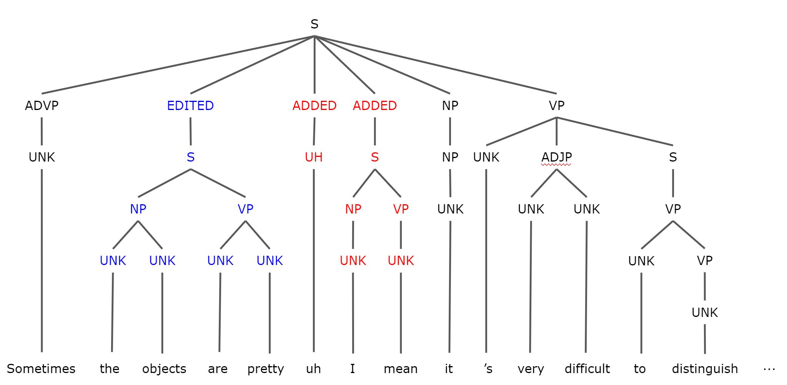

Disfluency Remover
------------------------------------------------------------
Disfluency Remover for speech is based on [Improving Disfluency Detection by Self-Training a Self-Attentive Model](https://www.aclweb.org/anthology/2020.acl-main.346/) from ACL 2020.

### Task
Disfluency refers to any interruptions in the normal flow of speech, including ones below.
> filled pauses (*um*, *uh*)  
> repetitions (*they're ... they're here*)  
> corrections (*to Sydney ... no to Melbourne*)  
> false starts (*we would like ... let's go*)  
> parenthetical asides (*you know*, *I mean*)  
> partial words (*wou-*, *oper-*)  
> interjections (*well*, *like*)  

One type of disfluency which is especially problematic for conventional syntactic parsers are speech repairs. A speech repair consists of two main parts; the *EDITED*, and the *ADDED*. As illustrated in the example below, `the objects are pretty` is the part of the EDITED PART, and `uh I mean` (which consists of a filled pause `uh` and a discourse marker `I mean`) is ADDED PART which is optional. The fluent version is obtained by removing the EDITED PARTS and the ADDED PARTS.

  

